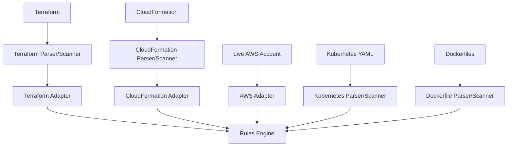
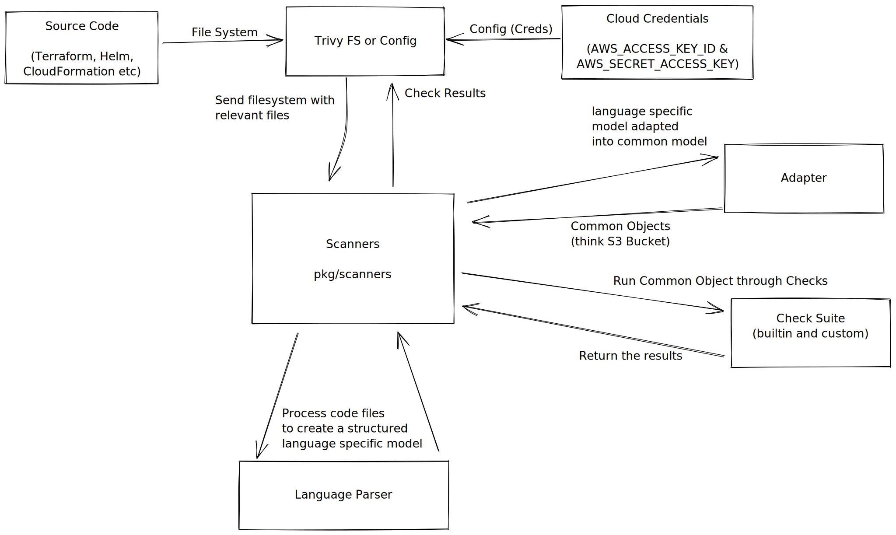

# Architecture

This document aims to answer the question *Where is the code that does X?*

For more information please check out our [contributing guide](CONTRIBUTING.md).

## Overview

The following diagram shows the high-level architecture of the project:

## Scanning Overview

The diagram below shows the process for parsing -> adapting -> scanning -> reporting.

> Note: Source code files (Terraform, CloudFormation) come in on a filesystem. AWS cloud scanning is done with AWS Creds being passed by Trivy

## Project Layout

The directory structure is broken down as follows:

- `avd_docs/` - The source for the [AVD documentation](https://aquasecurity.github.io/avd/).
- `cmd/` - The source for the `defsec` CLI. This CLI tool is primarily used during development for end-to-end testing without needing to pull the library into trivy/tfsec etc.
- `internal/adapters` - Adapters take input - such as a Terraform file or an AWS account - and _adapt_ it to a common format that can be used by the rules engine. This is where the bulk of the code is for supporting new cloud providers.
- `rules` - All of the rules and policies are defined in this directory.
- `pkg/detection` - Used for sniffing file types from both file name and content. This is done so that we can determine the type of file we're dealing with and then pass it to the correct parser.
- `pkg/extrafs` - Wraps `os.DirFS` to provide a filesystem that can also resolve symlinks.
- `pkg/formatters` - Used to format scan results in specific formats, such as JSON, CheckStyle, CSV, SARIF, etc.
- `pkg/providers` - A series of data structures for describing cloud providers and their resources as a common schema.
- `pkg/rego` - A package for evaluating Rego rules against given inputs.
- `pkg/rules` - This package exposes internal rules, and imports them accordingly (see _rules.go_).
- `pkg/scan` - Useful structs and functions for rules and scan results.
- `pkg/scanners` - Scanners for various inputs. For example, the `terraform` scanner will scan a Terraform directory and return a list of resources.
- `pkg/state` - The overall state object for Cloud providers is defined here. You should add to the `State` struct if you want to add a new cloud provider.
- `pkg/terraform` - Data structures for describing Terraform resources and modules.
- `pkg/types` - Useful types. Our types wrap a simple data type (e.g. `bool`) and add various metadata to it, such as file name and line number where it was defined.
- `test` - Integration tests and other high-level tests that require a full build of the project.
